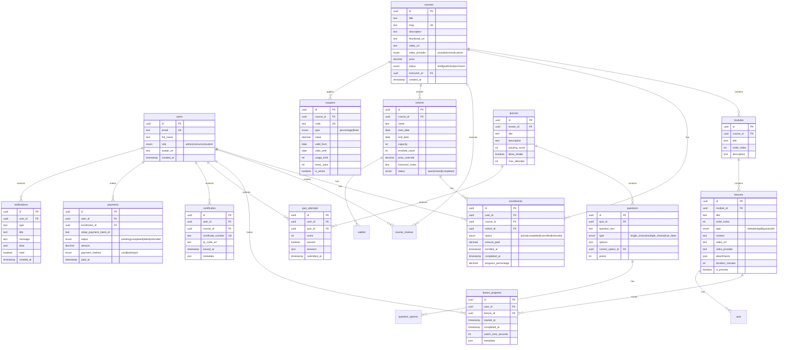

# Especificação Técnica - Plataforma de Cursos Online

## 1. Visão Geral

Plataforma completa de cursos online com painel administrativo, gestão de turmas (coortes), integração com Stripe para pagamentos, suporte a vídeos YouTube/Vimeo e emissão de certificados digitais.

## 2. Diagrama de Dados (ER)



## 3. Estrutura de Pastas

```
weacademy-frontend/
├── src/
│   ├── app/
│   │   ├── (public)/
│   │   │   ├── courses/
│   │   │   │   └── [slug]/
│   │   │   │       ├── page.tsx
│   │   │   │       └── enroll/
│   │   │   │           └── page.tsx
│   │   │   ├── my-courses/
│   │   │   │   └── [slug]/
│   │   │   │       ├── page.tsx
│   │   │   │       └── lessons/
│   │   │   │           └── [lessonId]/
│   │   │   │               └── page.tsx
│   │   │   └── verify-certificate/
│   │   │       └── [id]/
│   │   │           └── page.tsx
│   │   ├── (admin)/
│   │   │   └── admin/
│   │   │       ├── courses/
│   │   │       │   ├── page.tsx
│   │   │       │   ├── new/
│   │   │       │   │   └── page.tsx
│   │   │       │   └── [id]/
│   │   │       │       ├── page.tsx
│   │   │       │       ├── edit/
│   │   │       │       │   └── page.tsx
│   │   │       │       └── cohorts/
│   │   │       │           └── page.tsx
│   │   │       ├── students/
│   │   │       │   └── page.tsx
│   │   │       ├── payments/
│   │   │       │   └── page.tsx
│   │   │       └── analytics/
│   │   │           └── page.tsx
│   │   ├── api/
│   │   │   ├── webhooks/
│   │   │   │   └── stripe/
│   │   │   │       └── route.ts
│   │   │   ├── courses/
│   │   │   │   └── route.ts
│   │   │   ├── enrollments/
│   │   │   │   └── route.ts
│   │   │   └── certificates/
│   │   │       └── [id]/
│   │   │           └── route.ts
│   │   └── lib/
│   │       ├── validations/
│   │       │   ├── course.schema.ts
│   │       │   ├── lesson.schema.ts
│   │       │   └── cohort.schema.ts
│   │       ├── stripe.ts
│   │       └── resend.ts
│   ├── components/
│   │   ├── admin/
│   │   │   ├── course-form.tsx
│   │   │   ├── lesson-editor.tsx
│   │   │   ├── quiz-builder.tsx
│   │   │   └── cohort-manager.tsx
│   │   ├── courses/
│   │   │   ├── video-player.tsx
│   │   │   ├── lesson-navigator.tsx
│   │   │   ├── progress-tracker.tsx
│   │   │   └── quiz-modal.tsx
│   │   └── certificates/
│   │       └── certificate-viewer.tsx
│   └── types/
│       ├── course.ts
│       ├── lesson.ts
│       └── payment.ts
├── supabase/
│   └── migrations/
│       ├── 20241020000009_courses_complete.sql
│       ├── 20241020000010_cohorts.sql
│       ├── 20241020000011_lessons_quizzes.sql
│       └── 20241020000012_payments_certificates.sql
└── docs/
    └── SPEC_PLATAFORMA_CURSOS.md
```

## 4. Modelos de Dados (Zod Schemas)

### course.schema.ts

```typescript
import { z } from 'zod'

export const courseSchema = z.object({
  title: z.string().min(3, 'Título deve ter no mínimo 3 caracteres'),
  slug: z.string().regex(/^[a-z0-9-]+$/, 'Slug inválido'),
  description: z.string().min(50, 'Descrição deve ter no mínimo 50 caracteres'),
  thumbnail_url: z.string().url().optional(),
  video_url: z.string().url(),
  video_provider: z.enum(['youtube', 'vimeo', 'custom']),
  price: z.number().min(0),
  status: z.enum(['draft', 'published', 'archived']).default('draft'),
  instructor_id: z.string().uuid(),
  modules: z.array(z.object({
    title: z.string(),
    description: z.string().optional(),
    lessons: z.array(z.object({
      title: z.string(),
      type: z.enum(['video', 'text', 'pdf', 'quiz', 'audio']),
      content: z.string().optional(),
      video_url: z.string().url().optional(),
      video_provider: z.enum(['youtube', 'vimeo']).optional(),
      duration_minutes: z.number().default(0),
      is_preview: z.boolean().default(false),
      order_index: z.number()
    }))
  }))
})

export type CourseInput = z.infer<typeof courseSchema>
```

### lesson.schema.ts

```typescript
import { z } from 'zod'

export const lessonSchema = z.object({
  module_id: z.string().uuid(),
  title: z.string().min(3),
  order_index: z.number(),
  type: z.enum(['video', 'text', 'pdf', 'quiz', 'audio']),
  content: z.string().optional(),
  video_url: z.string().url().optional(),
  video_provider: z.enum(['youtube', 'vimeo', 'custom']).optional(),
  attachments: z.array(z.object({
    type: z.enum(['pdf', 'image', 'audio']),
    url: z.string().url(),
    filename: z.string()
  })).optional(),
  duration_minutes: z.number().default(0),
  is_preview: z.boolean().default(false),
  quiz: z.object({
    title: z.string(),
    passing_score: z.number().min(0).max(100),
    allow_retake: z.boolean().default(true),
    max_attempts: z.number().optional(),
    questions: z.array(z.object({
      question_text: z.string(),
      type: z.enum(['single_choice', 'multiple_choice', 'true_false']),
      options: z.array(z.object({
        id: z.string(),
        text: z.string(),
        is_correct: z.boolean()
      })),
      points: z.number().default(1)
    }))
  }).optional()
})

export type LessonInput = z.infer<typeof lessonSchema>
```

### cohort.schema.ts

```typescript
import { z } from 'zod'

export const cohortSchema = z.object({
  course_id: z.string().uuid(),
  name: z.string().min(3),
  start_date: z.date(),
  end_date: z.date(),
  capacity: z.number().min(1),
  price_override: z.number().optional(),
  instructor_notes: z.string().optional()
})

export type CohortInput = z.infer<typeof cohortSchema>
```

## 5. Rotas da API

### POST /api/courses

```typescript
// app/api/courses/route.ts
import { NextRequest, NextResponse } from 'next/server'
import { createServerClient } from '@/lib/supabase-server'
import { courseSchema } from '@/lib/validations/course.schema'
import { revalidatePath } from 'next/cache'

export async function POST(request: NextRequest) {
  const supabase = await createServerClient()
  
  // Verificar autenticação
  const { data: { user } } = await supabase.auth.getUser()
  if (!user) {
    return NextResponse.json({ error: 'Unauthorized' }, { status: 401 })
  }
  
  // Verificar se é admin ou instrutor
  const { data: profile } = await supabase
    .from('profiles')
    .select('role')
    .eq('id', user.id)
    .single()
  
  if (!['admin', 'instructor'].includes(profile?.role)) {
    return NextResponse.json({ error: 'Forbidden' }, { status: 403 })
  }
  
  const body = await request.json()
  const validatedData = courseSchema.parse(body)
  
  // Criar curso
  const { data: course, error: courseError } = await supabase
    .from('courses')
    .insert({
      title: validatedData.title,
      slug: validatedData.slug,
      description: validatedData.description,
      thumbnail_url: validatedData.thumbnail_url,
      video_url: validatedData.video_url,
      video_provider: validatedData.video_provider,
      price: validatedData.price,
      status: validatedData.status,
      instructor_id: validatedData.instructor_id
    })
    .select()
    .single()
  
  if (courseError) {
    return NextResponse.json({ error: courseError.message }, { status: 400 })
  }
  
  // Criar módulos e lições
  for (const module of validatedData.modules) {
    const { data: moduleData } = await supabase
      .from('modules')
      .insert({
        course_id: course.id,
        title: module.title,
        description: module.description,
        order_index: validatedData.modules.indexOf(module)
      })
      .select()
      .single()
    
    for (const lesson of module.lessons) {
      const lessonData: any = {
        module_id: moduleData.id,
        title: lesson.title,
        type: lesson.type,
        content: lesson.content,
        duration_minutes: lesson.duration_minutes,
        is_preview: lesson.is_preview,
        order_index: lesson.order_index
      }
      
      if (lesson.video_url) {
        lessonData.video_url = lesson.video_url
        lessonData.video_provider = lesson.video_provider
      }
      
      const { data: lessonResult } = await supabase
        .from('lessons')
        .insert(lessonData)
        .select()
        .single()
      
      // Criar quiz se existir
      if (lesson.quiz) {
        const { data: quizResult } = await supabase
          .from('quizzes')
          .insert({
            lesson_id: lessonResult.id,
            title: lesson.quiz.title,
            passing_score: lesson.quiz.passing_score,
            allow_retake: lesson.quiz.allow_retake,
            max_attempts: lesson.quiz.max_attempts
          })
          .select()
          .single()
        
        // Criar perguntas
        for (const question of lesson.quiz.questions) {
          const { data: questionResult } = await supabase
            .from('questions')
            .insert({
              quiz_id: quizResult.id,
              question_text: question.question_text,
              type: question.type,
              points: question.points
            })
            .select()
            .single()
          
          // Criar opções
          for (const option of question.options) {
            await supabase
              .from('question_options')
              .insert({
                question_id: questionResult.id,
                option_text: option.text,
                is_correct: option.is_correct
              })
          }
        }
      }
    }
  }
  
  revalidatePath('/admin/courses')
  
  return NextResponse.json({ course }, { status: 201 })
}

export async function GET(request: NextRequest) {
  const supabase = await createServerClient()
  const { searchParams } = new URL(request.url)
  const status = searchParams.get('status')
  
  let query = supabase
    .from('courses')
    .select('*, instructor:profiles!instructor_id(full_name, avatar_url)')
    .order('created_at', { ascending: false })
  
  if (status) {
    query = query.eq('status', status)
  }
  
  const { data, error } = await query
  
  if (error) {
    return NextResponse.json({ error: error.message }, { status: 400 })
  }
  
  return NextResponse.json({ courses: data })
}
```

### POST /api/enrollments

```typescript
// app/api/enrollments/route.ts
import { NextRequest, NextResponse } from 'next/server'
import { createServerClient } from '@/lib/supabase-server'
import { createPaymentIntent } from '@/lib/stripe'

export async function POST(request: NextRequest) {
  const supabase = await createServerClient()
  const { data: { user } } = await supabase.auth.getUser()
  
  if (!user) {
    return NextResponse.json({ error: 'Unauthorized' }, { status: 401 })
  }
  
  const { course_id, cohort_id, coupon_code } = await request.json()
  
  // Buscar curso
  const { data: course } = await supabase
    .from('courses')
    .select('*, cohorts(*)')
    .eq('id', course_id)
    .single()
  
  if (!course) {
    return NextResponse.json({ error: 'Course not found' }, { status: 404 })
  }
  
  // Verificar se já está inscrito
  const { data: existing } = await supabase
    .from('enrollments')
    .select('id')
    .eq('user_id', user.id)
    .eq('course_id', course_id)
    .eq('status', 'active')
    .maybeSingle()
  
  if (existing) {
    return NextResponse.json({ error: 'Already enrolled' }, { status: 400 })
  }
  
  // Aplicar cupom se existir
  let finalPrice = course.price
  if (coupon_code) {
    const { data: coupon } = await supabase
      .from('coupons')
      .select('*')
      .eq('code', coupon_code)
      .eq('is_active', true)
      .single()
    
    if (coupon) {
      if (coupon.type === 'percentage') {
        finalPrice = finalPrice * (1 - coupon.value / 100)
      } else {
        finalPrice = Math.max(0, finalPrice - coupon.value)
      }
    }
  }
  
  // Criar Payment Intent no Stripe
  const paymentIntent = await createPaymentIntent({
    amount: Math.round(finalPrice * 100), // converter para centavos
    currency: 'brl',
    metadata: {
      user_id: user.id,
      course_id,
      cohort_id
    }
  })
  
  // Criar inscrição pendente
  const { data: enrollment } = await supabase
    .from('enrollments')
    .insert({
      user_id: user.id,
      course_id,
      cohort_id,
      status: 'pending',
      amount_paid: finalPrice
    })
    .select()
    .single()
  
  // Criar registro de pagamento
  await supabase
    .from('payments')
    .insert({
      user_id: user.id,
      enrollment_id: enrollment.id,
      stripe_payment_intent_id: paymentIntent.id,
      status: 'pending',
      amount: finalPrice,
      payment_method: 'card'
    })
  
  return NextResponse.json({
    enrollment,
    client_secret: paymentIntent.client_secret
  })
}
```

### POST /api/webhooks/stripe

```typescript
// app/api/webhooks/stripe/route.ts
import { NextRequest, NextResponse } from 'next/server'
import { createServerClient } from '@/lib/supabase-server'
import Stripe from 'stripe'
import { Resend } from 'resend'

const stripe = new Stripe(process.env.STRIPE_SECRET_KEY!)
const resend = new Resend(process.env.RESEND_API_KEY!)

export async function POST(request: NextRequest) {
  const body = await request.text()
  const signature = request.headers.get('stripe-signature')!
  
  let event: Stripe.Event
  
  try {
    event = stripe.webhooks.constructEvent(
      body,
      signature,
      process.env.STRIPE_WEBHOOK_SECRET!
    )
  } catch (err) {
    return NextResponse.json({ error: 'Invalid signature' }, { status: 400 })
  }
  
  const supabase = await createServerClient()
  
  if (event.type === 'payment_intent.succeeded') {
    const paymentIntent = event.data.object as Stripe.PaymentIntent
    const { user_id, course_id, cohort_id } = paymentIntent.metadata
    
    // Atualizar status do pagamento
    await supabase
      .from('payments')
      .update({
        status: 'completed',
        paid_at: new Date().toISOString()
      })
      .eq('stripe_payment_intent_id', paymentIntent.id)
    
    // Ativar inscrição
    await supabase
      .from('enrollments')
      .update({ status: 'active' })
      .eq('user_id', user_id)
      .eq('course_id', course_id)
    
    // Criar notificação
    await supabase
      .from('notifications')
      .insert({
        user_id,
        type: 'enrollment_confirmed',
        title: 'Inscrição Confirmada!',
        message: `Sua inscrição no curso foi confirmada. Comece a estudar agora!`,
        data: { course_id }
      })
    
    // Enviar email de boas-vindas
    const { data: user } = await supabase
      .from('profiles')
      .select('email, full_name')
      .eq('id', user_id)
      .single()
    
    const { data: course } = await supabase
      .from('courses')
      .select('title')
      .eq('id', course_id)
      .single()
    
    await resend.emails.send({
      from: 'WE Academy <cursos@wemarketingmedico.com>',
      to: user.email,
      subject: 'Bem-vindo ao curso!',
      html: `
        <h1>Parabéns, ${user.full_name}!</h1>
        <p>Sua inscrição no curso <strong>${course.title}</strong> foi confirmada.</p>
        <a href="${process.env.NEXT_PUBLIC_SITE_URL}/my-courses/${course_id}">Começar agora</a>
      `
    })
  }
  
  return NextResponse.json({ received: true })
}
```

## 6. Componentes Principais

### VideoPlayer.tsx

```typescript
'use client'

import { useEffect, useRef } from 'react'
import YouTube from 'react-youtube'

interface VideoPlayerProps {
  videoUrl: string
  provider: 'youtube' | 'vimeo'
  onProgress?: (seconds: number) => void
}

export function VideoPlayer({ videoUrl, provider, onProgress }: VideoPlayerProps) {
  const getVideoId = (url: string): string | null => {
    if (provider === 'youtube') {
      const match = url.match(/(?:youtube\.com\/watch\?v=|youtu\.be\/)([^&\n?#]+)/)
      return match ? match[1] : null
    }
    // Vimeo: https://vimeo.com/VIDEO_ID
    const match = url.match(/vimeo\.com\/(\d+)/)
    return match ? match[1] : null
  }
  
  const videoId = getVideoId(videoUrl)
  
  if (provider === 'youtube' && videoId) {
    return (
      <div className="aspect-video w-full">
        <YouTube
          videoId={videoId}
          opts={{
            width: '100%',
            height: '100%',
            playerVars: {
              autoplay: 0,
              controls: 1,
              modestbranding: 1
            }
          }}
          onStateChange={(e) => {
            // TODO: Track progress
            if (onProgress) {
              e.target.getCurrentTime().then((time) => onProgress(time))
            }
          }}
        />
      </div>
    )
  }
  
  if (provider === 'vimeo' && videoId) {
    return (
      <div className="aspect-video w-full">
        <iframe
          src={`https://player.vimeo.com/video/${videoId}?controls=1`}
          className="w-full h-full"
          allowFullScreen
        />
      </div>
    )
  }
  
  return <div>Video URL inválido</div>
}
```

## 7. Backlog de Próximos Passos

### Prioridade Alta
- [ ] Implementar stripe checkout no frontend
- [ ] Criar página de geração de certificados PDF
- [ ] Sistema de notificações por email (n8n)
- [ ] Upload de arquivos para Supabase Storage
- [ ] Testes E2E com Playwright

### Prioridade Média
- [ ] App mobile (React Native)
- [ ] Chat em tempo real no curso (Socket.io)
- [ ] Sistema de badges/gamificação
- [ ] Analytics avançado com Mixpanel
- [ ] Integração com Zoom para aulas ao vivo

### Prioridade Baixa
- [ ] IA chat bot no curso (OpenAI)
- [ ] Tradução i18n (EN/ES)
- [ ] Marketplace de cursos
- [ ] White-label para múltiplos clientes

## 8. Testes

```typescript
// __tests__/course.test.ts
import { describe, it, expect } from '@jest/globals'
import { courseSchema } from '@/lib/validations/course.schema'

describe('Course Schema', () => {
  it('should validate a valid course', () => {
    const validCourse = {
      title: 'React Avançado',
      slug: 'react-avancado',
      description: 'Curso completo de React com hooks e context',
      video_url: 'https://youtube.com/watch?v=123',
      video_provider: 'youtube',
      price: 199.99,
      instructor_id: 'uuid-here'
    }
    
    expect(() => courseSchema.parse(validCourse)).not.toThrow()
  })
  
  it('should reject invalid course', () => {
    const invalidCourse = {
      title: 'AB',
      slug: 'Invalid Slug!',
      description: 'Too short'
    }
    
    expect(() => courseSchema.parse(invalidCourse)).toThrow()
  })
})
```

---

**Criado para WE Academy by WE Marketing Médico** 🏥
